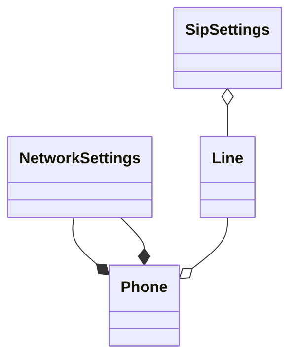

Привет! Мы проектируем модуль автопровижнинга IP-телефонов (Yealink, Cisco SPA, Grandstream) для интеграции с АТС на базе PBX Issabel/FreePBX (Asterisk, драйверы chan_sip/PJSIP, база данных MariaDB). Структура нужных данных одинакова в их БД 

Архитектура приложения: Go (Golang), Clean Architecture / DDD principles. Данные генерируются "на лету" на основе парсинга User-Agent/OUI.

UseCase:

1. SIP телефон запрашивает конфиг(узнал из DHCP 66)
2. Hendler принимает запрос, парсит mac и vendorа с моделью если возможно. Передаёт запрос Сервису по управлению конфигурациям на получение конфигурации по ID
3.Service приняв мак проверяет поддерживаются ли вендоры(белый список), и отправляет запрос в репозиторий. 
4. Репозиторий идет в БД, если там есть запись, возвращает DDD структуру сервису. если нет ошибку
5. Сервис смотрит, если пришла ошибка или сонфиг не полный(не заполнены минимально требуемые поля.) то отдаёт ошибку хендлеру. сам же, если записи в БД нет, Запускает процедуру создания записи, Проверяет вендора, модель, идет в OUI. Всё норм создаёт запись и ставит значения по умолчанию и отправляет на запись в БД. Иначе завершается с логом что это мусор.
6. Если Hendler получает ошибку -> 404 конфигурации пока нет, если Конфигурация не полная тоже 404 или что то другое(зайди по позже). Если конфиг получен отдаёт генератору конфигов.
7. Генератор запрашивает у фабрики генераторов "Генератор" для конкретной модели
8. фабрика смотрит на вендора/модель и возвращает указательна структуру под интрефейсом 
9. Сервис-Генератор создаёт поток  файла и отдаёт его Hendlerу.
10. Hendler получив поток от сервиса отдает его тому кто запросил.

У нас есть корневой агрегат Phone (Устройство) и дочерние сущности
- PhoneLine (Линия). На одном устройстве может быть несколько линий. Тут информация регистрации линии и параметрах подключения.
- NetworkSettings(Настройки сети) - информация с настройками сети.  
- GeneralSettings(Общие настройки), суда вынесены пароли доступа к управлению телефона, параметры провижинига и т.п.
так же "атомарные" параметры 
- MAC адресс - строка
- Модель
- Производитель
- Маркер наличия изменений в конфигурации
- маркер для определения готовности в к использованию(больше для поиска в БД). Надо вычислять каждый раз, а может и нет.
- время последней передачи.
Может ещё что то потребоваться

Конфигурация должа Заполняться в соответствии с преоритетом от наименьшего к наибольшему

- Файл с настройками по умолчанию. Адреса серверов, порты, кодеки, параметры транспорта если параметры в структуре есть не менять. Требуется при создании объекта конфигурации и записи в бд. (в большинстве случаев если этой информации нет вы системе PBX)
- Система PBX - информация получается из двух таблиц `sip`  EAV-таблица, и `users`  должа перезаписать данные из таблицы если они отличаются(просто перезаписать)
- Параматры установленные в ручную администратором. Должны перезаписать все. Если данные удалены, вернуть ко варианту по умолчанию

Текущий консенсус по хранению данных (схема приоритетов):

1. Персистентная структура устройств и привязки линий (какой Extension на каком слоте/кнопке телефона сидит) а так же иных наборов параметров хранится в НАШЕЙ базе данных (таблицы `phones`, `phone_lines` и т.п.). Там же хранятся кастомные переопределения параметров из REST API (Приоритет 1).

2. Технические данные SIP-аккаунта (пароли, отображаемые имена) динамически «втягиваются» из БД Asterisk из EAV-таблиц `sip`/`pjsipsettings` и `users` в момент запроса конфига (Приоритет 2).

3. Если данных нет нигде — применяются глобальные системные дефолты (Приоритет 3).

Давай продолжим проектирование. Нам нужно сначала определить доменные структуры для конфигурации. Мое предложение разделить следующим образом `Phone` 

Вделяются три сущности, Линия `Line` - все настройки подключения и передачи, Телефон `Phone` - Общий конфиг и `SipSettings`.  И нескольго ValueObject `NetworkSettings` и `NetworkSettings`. Надо подумать вариан переопределения параметров. Для Всего агрегата,
На первом шаге определим какие данные должны хранить сущности и объекты общие для все SIP телефонов